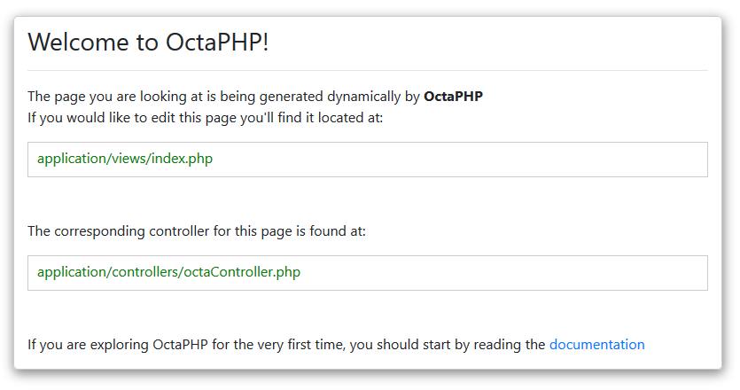

# OctaPHP
A lightweight PHP framework with less than 40MB designed for complex web algorithm, highly customizable and inspired by codeigniter framework. OctaPHP uses Twig template engine of [symfony-framework](https://twig.symfony.com/) and 
an active record with Object-Relational-Mapping (ORM) ready of [RedBeanPHP](https://redbeanphp.com/index.php).

> Development is underway, with Phase 4 completed in June-27-2019. It is *not* ready for production use - the current version is considered pre-alpha-2.

[](https://travis-ci.org/badges/badgerbadgerbadger) 
[](https://coveralls.io/r/badges/badgerbadgerbadger) 
[](http://badges.mit-license.org) 
[](https://github.com/badges/badgerbadgerbadger)

## Powered By


__When will you use OctaPHP?__
- If you want a framework with a very small footprint and highly customizable.
- With a powerful Object-Relational-Mapping (ORM) active record.
- With a powerful template engine.
- Concise, Extensible and Testable.
- Less head scratch when reading the framework-core

# Who is behind OctaPHP?
OctaPHP is brought to you by [Melquecedec Catang-catang](https://www.linkedin.com/in/melquecedec-catang-catang), the creator of the [OctaPDO](https://github.com/synestergates788/OctaPDO) and OctaPDO+RedBeanPHP. OctaPHP is released under the MIT license. 

## Getting Started
installing OctaPHP does not require composer, just clone the project and put it in the directory where your local server allocated.

### Prerequisites
```
-Php 5.4+
-mysql (any version that supports php 5.4+)
```
If successfully installed, you should see the default welcome page of OctaPHP shown below: <br />

> After installing OctaPHP we highly recommend you to remove the default controller and view for welcome page as it is no longer needed in your development.

# OctaPHP CORE Documentation
### Setting-Up your database
Open the database config file located at ```application/config/database.php``` and modify.
```
$database = array(
    'hostname' => 'localhost',
    'username' => 'root',
    'password' => '',
    'database' => 'your_database_name',
    'encrypt' => FALSE
);
```

### Setting-Up your Project Root Directory
Open the config file located at ```application/config/config.php``` and change the ```singleevents``` to your application root directory.
```
$base_url = 'http://'.$_SERVER['SERVER_NAME'].DS.'your_project_root_directory';
```

### Setting-Up your Default Controller
```Default-Controller``` will be serve as the landing page when accessing your site (ex: www.example.com),
for most cases ```login-controller``` is usually set as the landing page of the site.

for now, we'll assume that we already created a file ```loginController.php``` under ```application/controllers/login/```.
To set this controller as the landing page, we need to add this to our config file, so open ```config.php``` file located at ```application/config/config.php``` and modify the value of ```$default_controller``` variable.
```
$default_controller = [
    "DIRECTORY" => "login",
    "CONTROLLER" => "loginController",
];
```
In the example above, we've set the __DIRECTORY__ and __CONTROLLER__ value where ```login``` is the folder/directory that contains the ```loginController``` class.

### Working with Controllers Plus Router
By default if you create a controller, OctaPHP will automatically give a default route. 

So if we create a controller-class ```event.php``` under ```controllers/home``` directory, by default OctaPHP will render it like this below. where __/home/__ is the directory that contains your __event__ controller.
```
www.example.com/home/event-actions
```
In the example above you will notice that __-actions__ was added to your controller filename, instead of accessing your controller ```www.example.com/home/event``` you will access this ```www.example.com/home/event-actions```. That's how default route provided by OctaPHP works.

__Overwriting Route__ <br />
To overwrite default-route open the ```route.php``` under ```application/config/``` directory, and put the below code.
```
$default_routes['/home/event/([a-z0-9_-]+)?/([a-z0-9_-]+)?'] = ROOT.DS.'application'.DS.'controllers'.DS.'home'.DS.'event';

//Note: Segment 4 are optional, segment 4 takes your methods parameter value.
//So if you have something like this
//www.example.com/home/event/get_data/4
//Segment 4 now holds the value [4] for your [get_data] methods inside your controller-class [event]
```
The first segment __/home/__ is your controller directory, the second segment __/event/__ is your event.php controller-class, the third segment __/([a-z0-9_-]+)?/__ is your class method and the last segment __/([a-z0-9_-]+)?/__ is your methods parameter.

Now that we already overwrited default-route, we can now access the controller on the url like.
```
www.example.com/home/event
```
instead of
```
www.example.com/home/event-actions
```

> __Note:__ OctaPHP won't allow controller having the same filename or class name in the entire platform (ex: controllers/home/homeController.php And controllers/about/homeController.php). A 'Human Factor' is the point.
Not only editing wrong file issue but also working with these classes in the same code would be a total mess, Controllers must be unique.

### Static Page
> __Note:__ This tutorial assumes you’ve already downloaded and installed OctaPHP framework in your development environment and a basic knowledge on [Twig](https://twig.symfony.com/doc/2.x/templates.html) template engine.

The first thing you’re going to do is set up a controller to handle static pages. A controller is simply a class that helps delegate work. It is the glue of your web application.
For example, when a call is made to:
```
http://example.com/blog/video/10
```
We might imagine that there is a controller named blog. The method being called on blog would be video. The blog method’s job could be to grab 10 video items, and render them on the page. Very often in MVC, you’ll see URL patterns that match:
```
http://example.com/[controller-class]/[controller-method]/[arguments]
```

As URL schemes become more complex this may change. But for now this is all we will need to know.
Create a file at ```application/controllers/Page/Pages.php``` with the following code.
```
<?php
class Pages extends Controller {
    public function index()
    {
    }
}
```
You have created a class named Pages, with a default ```index``` method. The Pages class is extending the Controller class. This means that the new pages class can access the methods and variables defined in the Controller class ```application/core/Controller.php```.
<br />

Now you’ve created your first method, it’s time to make some basic page. We will be creating “views” (page).
Create a file at ```application/views/pages/static_page.html.twig``` and add the following code:

```
<!DOCTYPE html>
<html lang="en">
<head>
    <meta charset="UTF-8">
    <meta name="viewport" content="width=device-width, initial-scale=1.0">
    <title>first twig template</title>
</head>
<body>
    <table border="1px">
        <tr>
            <th>Name</th>
            <th>Email</th>
            <th>Password</th>
        </tr>
        <tr>
            <td>john doe</td>
            <td>jdoe@gmail.com</td>
            <td>admin</td>
        </tr>
    </table>
</body>
</html>
```
__Add Logic To The Controller__
<br />
Earlier you set up a controller with an ```index``` method. The static page will be located in the application/views/pages/ directory.
In order to load the ```static_page.html.twig``` page, you’ll have to add the below code to your ```index``` method.
```
class Pages extends Controller {
    public function index()
    {
        $this->view('pages/static_page.html.twig');
    }
}
```

### Dynamic Page Containing Query Results
The first thing to do is to create a model at ```application/models/page/static_page_model.php```

By now, we will just assume that you have created a ```users``` table in your database containing ```[user_id, first_name, last_name]``` fields.
add value to your ```users``` table (john doe, jane doe, smith doe)
```
class static_page_model extends Model {
    public get_data(){
        $this->octa->get('users');
        $result = $this->octa->result(); //this will contains an array on result
        return ($result) ? $result : false;
    }
}
```
Now you’ve created your first model with a method ```get_data``` which contains [john doe, jane doe, smith doe] using the OctaPHP active record, it’s time to make some changes on the ```pages``` controller we created earlier.
Add the following code in your ```pages``` class:
```
class Pages extends Controller {
    public function __construct(){
        parent::__construct();
	
        $this->model('static_page_model','spm'); //this will initiate your model globally inside your class
    }                                            //the second parameter 'spm' is your model alias, this parameter is optional
	
    public function index()
    {
        $result = $this->spm->get_data();   //once the model is initiated you now have access on all methods inside your model
	
        $data['result'] = $result;
        $this->view('pages/static_page.html.twig',$data);
    }
}
```
In the above method ```index``` you can see that the ```$data``` containing the query result was pass at the ```view``` as the second parameter ```$this->view('', $data);```

To fetch the data in your view, simply add the below code in your view we created earlier.
```
<!DOCTYPE html>
<html lang="en">
<head>
    <meta charset="UTF-8">
    <meta name="viewport" content="width=device-width, initial-scale=1.0">
    <title>first twig template</title>
</head>
<body>
    <table border="1px">
        <tr>
            <th>Name</th>
            <th>Email</th>
            <th>Password</th>
        </tr>
        
            
                <tr>
                    <td>{{ user.first_name }} {{ user.last_name }}</td>
                    <td>{{ user.email }}</td>
                    <td>{{ user.password }}</td>
                </tr>
            
        
    </table>
</body>
</html>
```
After fetching result, your table will now look like this if you view the source of your markup.
```
<html lang="en">
<head>
    <meta charset="UTF-8">
    <meta name="viewport" content="width=device-width, initial-scale=1.0">
    <title>first twig template</title>
</head>
<body>
    <table border="1px">
        <tr>
            <th>Name</th>
            <th>Email</th>
            <th>Password</th>
        </tr>
        <tr>
            <td>john doe</td>
            <td>johndoe@gmail.com</td>
            <td>admin</td>
        </tr>
        <tr>
            <td>jane doe</td>
            <td>janedoe@gmail.com</td>
            <td>admin</td>
        </tr>
    </table>
</body>
</html>
```
At this moment, we can see that fetching data from controller to the view works perfect.
<br />
### Working with Sessions
First thing to do is to enable session, open ```config.php``` located at ```application/config/``` and set the value to TRUE.
```
$config['session'] = true;
```
To start/initiate session simply call this ```$this->session();``` inside your class-methods.
```
class Pages extends Controller{
    public function __construct(){
        parent::__construct();
		
    }
	
    public function load_session(){
        $this->session();
    }
}
```

But for a much better OOP practice, we need to initiate session globally so that you don't have to call it on every class-methods you have in your class-controller.
To start/initiate session globally inside you class we need to call the ```$this->session();``` inside your constructor ```__construct```.
```
class Pages extends Controller{
    public function __construct(){
        parent::__construct();
	
        $this->session();
    }
}
```
Now that we already iniated session globally, all your methods inside your class can access session.

### Two ways to get your data sessioned. <br />
__First:__ passing an array of data containing the value to be session

```
class Pages extends Controller{
    public function __construct(){
        parent::__construct();
	
        $this->session();
    }
	
    public function load_session(){
        $data = array(
            "user_id"=>"1",
            "email"=>"admin@gmail.com",
            "password"=>"admin",
        );

        $this->session->start($sess_data);
    }
}
```
__Second:__ initializing it one at a time.

```
class Pages extends Controller{
    public function __construct(){
        parent::__construct();
	
        $this->session();
    }
	
    public function load_session(){
        $this->session->start("email","admin@gmail.com");
    }
}
```

### Destroying Sessions
To destroy all session data.
```
$this->session->destroy('All');
```
> This will destroy all data that is session.
<br />

To destroy sepecific data. <br />
If you have an array of data being session and you just want to destroy specific data, this functionality will be very helpfull.
```
$this->session->destroy('email');
```

### Getting Sessioned Data
To get all data being sessioned
```
$this->session->get('All');
```
> This will return an array of data containing the data being sessioned.

To get specific data being sessioned.
```
$this->session->get('email');
```
> This will return a string containing the value of __email__ being sessioned.

### Libraries
> __Note:__ OctaPHP won't recognize your custom libraries if not loaded.

To load your custom libraries, first thing is to make sure that your custom libraries are inside ```application/library/``` directory. <br /><br />
For now we'll assume that you already created a library "library_1.php","library_2.php" and "library_3.php" under ```application/library/``` directory.
To load it globally open the file ```autoload.php``` under ```application/config/``` and add your libraries in the ```$autoload['libraries']``` variable.
```
$autoload['libraries'] = array('library_1','library_2','library_3');
```
Once loaded, you can use your custom libraries in your entire platform.

### Helpers
> __Note:__ OctaPHP won't recognize your custom helper's if not loaded.

Same thing we did on the libraries, you need to put all your custom helpers inside ```application/helpers/``` directory.
Open ```autoload.php``` under ```application/config/``` and add your custom helpers in the ```$autoload['helpers']``` variable.
```
$autoload['helper'] = array('your_helper_1','your_helper_2','your_helper_3');
```

# OctaPHP Template Enheritance Documentation
See [Documentation](https://twig.symfony.com/)
> OctaPHP is using Twig developed by __Fabien Potencier__.

Twig template engine won't recognize any extension files like css, javascript, sass, less, templates and etc. unless the directory that contains this files is defined.
For most cases this files (css, javascript, sass, less, templates...) can be found on assets directory. Read below instructions to define assets directory.

### Defining Assets Directory
Assets is where you mostly store your CSS, SASS, LESS, JAVASCRIPT, Templates and etc. files across the entire platform.
By default, OctaPHP generates assets directory inside ```application```
```
application/assets/
application/assets/css
application/assets/js
application/assets/vendor
```
- What if you prefer another term than ```assets```?
- What if you want it to be stored on another directory rather than inside ```application/assets```?

The good thing is you can always modify this directory when and whatever and you want.

To modify assets directory, open ```assets.php``` file located at ```application/config/``` and change the below code.
```
$assets_config['assets'] = [
    "assets" => base_url.DS.'application'.DS.'assets',
];
```
Where ```array index of 0``` is your global variable that defines your assets, and ```array index of 1``` is the directory of your assets.

### Basics Of Template Inheritance using Twig
Template Inheritance usually involves two separate templates, each in their own file: the **parent** template and the **child** template. The parent contains the HTML skeleton and markers for where content should go. These markers are called **blocks**. The child then “fills-in” the blocks with content. 
Take a look at the example below:

**base_template.html.twig (the parent)**
```
<!DOCTYPE html>
<html lang="en">
<head>
    <meta charset="UTF-8">
    <meta name="viewport" content="width=device-width, initial-scale=1.0">
    <title>first twig template</title>
</head>
<body>
    
    
</body>
</html>
```
**page.html.twig (the child)**
```
//Note: variable user is an array of data containing users data



    <table border="1px">
        <tr>
            <th>Name</th>
            <th>Email</th>
            <th>Password</th>
        </tr>
        
            
                <tr>
                    <td>{{ user.first_name }} {{ user.last_name }}</td>
                    <td>{{ user.email }}</td>
                    <td>{{ user.password }}</td>
                </tr>
            
        
    </table>

```
**page.html.twig output**
```
<html lang="en">
<head>
    <meta charset="UTF-8">
    <meta name="viewport" content="width=device-width, initial-scale=1.0">
    <title>first twig template</title>
</head>
<body>
    <table border="1px">
        <tr>
            <th>Name</th>
            <th>Email</th>
            <th>Password</th>
        </tr>
        <tr>
            <td>john doe</td>
            <td>johndoe@gmail.com</td>
            <td>admin</td>
        </tr>
        <tr>
            <td>jane doe</td>
            <td>janedoe@gmail.com</td>
            <td>admin</td>
        </tr>
    </table>
</body>
</html>
```
> **Note:** The child is always responsible for declaring its parent. This is done with a simple include statement at the beginning of the child file. When declaring a parent, it is also possible to use require. However, include is preferred as it does not throw a fatal error if the parent does not exist.

# OctaPHP Active Record Documentation
**$this->octa->get(); And $this->octa->result();** <br />
Runs the selection query and returns an array of result.

```
$this->octa->get('mytable');
$query = $this->octa->result();

// Produces: SELECT * FROM mytable
```

The second and third parameters of ```$this->octa->get()``` enable you to set a limit and offset clause:
```
$this->octa->get('mytable', 10, 20); <br />
$query = $this->octa->result();
// Produces: SELECT * FROM mytable LIMIT 20, 10 (in MySQL. Other databases have slightly different syntax)
```

You'll notice that the above function is assigned to a variable named $query, which can be used to show the results:
```
$this->octa->get('mytable');
$query = $this->octa->result();

foreach ($query as $row)
{
    echo $row->title;
}
```
<br />

**$this->octa->get(); And $this->octa->row();** <br />
Runs the selection query and returns a row of data.

```
$this->octa->get('mytable');
$query = $this->octa->row();

// Produces: SELECT * FROM mytable LIMIT 1
```

You'll notice that the above function is assigned to a variable named $query, which can be used to fetch the row:
```
$this->octa->get('mytable');
$query = $this->octa->row();
echo $query['title']
```
<br />

**$this->octa->get(); And $this->octa->num_rows();** <br />
Permits you to determine the number of rows in a particular table. 

```
$this->octa->get('mytable');
$query = $this->octa->num_rows();

// Produces an integer, like 25
```

You'll notice that the above function is assigned to a variable named $query, which can be used to fetch the row:
```
$this->octa->get('mytable');
$query = $this->octa->row();
echo $query; //return number of rows
```
<br />

**$this->octa->last_query(); (for sql debugging)** <br />
Permits you to determine the last query which was run

```
$this->octa->get('mytable');
$query = $this->octa->result();
$last_query = $this->octa->last_query();
echo $last_query;

// will return sql code: "SELECT * FROM mytable"
```
<br />

**$this->octa->select();** <br />
Permits you to write the SELECT portion of your query:

```
$this->octa->select('title, content, date');

$query = $this->octa->get('mytable');

// Produces: SELECT title, content, date FROM mytable
```
$this->octa->select() accepts an optional second parameter. If you set it to FALSE, OctaPHP will not try to protect your field or table names with backticks. This is useful if you need a compound select statement.
```
$this->octa->select('(SELECT SUM(payments.amount) FROM payments WHERE payments.invoice_id=4') AS amount_paid', FALSE);
$query = $this->octa->get('mytable');
```
<br />

**$this->octa->join();** <br />
Permits you to write the JOIN portion of your query:

```
$this->octa->select('*');
$this->octa->join('comments', 'comments.id = blogs.id');
$this->octa->get('blogs');
$query = $this->octa->result();

// Produces:
// SELECT * FROM blogs
// INNER JOIN comments ON comments.id = blogs.id
```

Multiple function calls can be made if you need several joins in one query. <br />
If you need a specific type of JOIN you can specify it via the third parameter of the function. Options are: left, right, outer, inner, left outer, and right outer.

```
 $this->octa->join('comments', 'comments.id = blogs.id', 'LEFT');

// Produces: LEFT JOIN comments ON comments.id = blogs.id
```
<br />

**$this->octa->where();** <br />
This function enables you to set WHERE clauses using one of four methods:

* Simple key/value method: <br />
Notice that the equal sign is added for you.
If you use multiple function calls they will be chained together with AND between them:
	```
	$this->octa->where('name', $name);
	$this->octa->where('title', $title);
	$this->octa->where('status', $status);

	// WHERE name = 'Joe' AND title = 'boss' AND status = 'active' 
	```
* Custom key/value method: <br />
You can include an operator in the first parameter in order to control the comparison:
```
$this->octa->where('name !=', $name);
$this->octa->where('id <', $id);

// Produces: WHERE name != 'Joe' AND id < 45 
```
* Associative array method: <br />
You can include your own operators using this method as well:
```
$array = array('name' => $name, 'title' => $title, 'status' => $status);

$this->octa->where($array);

// Produces: WHERE name = 'Joe' AND title = 'boss' AND status = 'active' 
```

* Custom string: <br />
You can write your own clauses manually:
```
$where = "name='Joe' AND status='boss' OR status='active'";

$this->octa->where($where);
```
**$this->octa->where()** <br />
accepts an optional third parameter. If you set it to FALSE, OctaPHP will not try to protect your field or table names with backticks.
<br />

**$this->octa->or_where();** <br />
This function is identical to the one above, except that multiple instances are joined by OR:
```
 $this->octa->where('name !=', $name);
$this->octa->or_where('id >', $id);

// Produces: WHERE name != 'Joe' OR id > 50
```
<br />

**$this->octa->where_in();** <br />
Generates a WHERE field IN ('item', 'item') SQL query joined with AND if appropriate
```
$names = array('Frank', 'Todd', 'James');
$this->octa->where_in('username', $names);
// Produces: WHERE username IN ('Frank', 'Todd', 'James')
```
<br />

**$this->octa->or_where_in();** <br />
Generates a WHERE field IN ('item', 'item') SQL query joined with OR if appropriate
```
$names = array('Frank', 'Todd', 'James');
$this->octa->or_where_in('username', $names);
// Produces: OR username IN ('Frank', 'Todd', 'James')
```
<br />

**$this->octa->where_not_in();** <br />
Generates a WHERE field NOT IN ('item', 'item') SQL query joined with AND if appropriate
```
 $names = array('Frank', 'Todd', 'James');
$this->octa->where_not_in('username', $names);
// Produces: WHERE username NOT IN ('Frank', 'Todd', 'James')
```
<br />

**$this->octa->or_where_not_in();** <br />
Generates a WHERE field NOT IN ('item', 'item') SQL query joined with OR if appropriate
```
$names = array('Frank', 'Todd', 'James');
$this->octa->or_where_not_in('username', $names);
// Produces: OR username NOT IN ('Frank', 'Todd', 'James')
```
<br />

**$this->octa->like();** <br />
This function enables you to generate LIKE clauses, useful for doing searches.

* Simple key/value method: <br />
```
$this->octa->like('title', 'match');

// Produces: WHERE title LIKE '%match%' 
```
If you use multiple function calls they will be chained together with AND between them:
```
$this->octa->like('title', 'match');
$this->octa->like('body', 'match');

// WHERE title LIKE '%match%' AND body LIKE '%match%
```
If you want to control where the wildcard (%) is placed, you can use an optional third argument. Your options are 'before', 'after' and 'both' (which is the default). 
```
$this->octa->like('title', 'match', 'before');
// Produces: WHERE title LIKE '%match'

$this->octa->like('title', 'match', 'after');
// Produces: WHERE title LIKE 'match%'

$this->octa->like('title', 'match', 'both');
// Produces: WHERE title LIKE '%match%' 
```
If you do not want to use the wildcard (%) you can pass to the optional third argument the option 'none'. 
```
$this->octa->like('title', 'match', 'none');
// Produces: WHERE title LIKE 'match' 
```
* Associative array method: <br />
```
$array = array('title' => $match, 'page1' => $match, 'page2' => $match);

$this->octa->like($array);

// WHERE title LIKE '%match%' AND page1 LIKE '%match%' AND page2 LIKE '%match%'
```
<br />

**$this->octa->or_like();** <br />
This function is identical to the one above, except that multiple instances are joined by OR:
```
$this->octa->like('title', 'match');
$this->octa->or_like('body', $match);

// WHERE title LIKE '%match%' OR body LIKE '%match%'
```

**$this->octa->not_like();** <br />
This function is identical to like(), except that it generates NOT LIKE statements:
```
$this->octa->not_like('title', 'match');

// WHERE title NOT LIKE '%match%
```
<br />

**$this->octa->or_not_like();** <br />
This function is identical to not_like(), except that multiple instances are joined by OR:
```
$this->octa->like('title', 'match');
$this->octa->or_not_like('body', 'match');

// WHERE title LIKE '%match% OR body NOT LIKE '%match%'
```
<br />

**$this->octa->group_by();** <br />
Permits you to write the GROUP BY portion of your query:
```
$this->octa->group_by("title");

// Produces: GROUP BY title 
```
You can also pass an array of multiple values as well:
```
$this->octa->group_by(array("title", "date"));

// Produces: GROUP BY title, date
```
<br />

**$this->octa->order_by();** <br />
Lets you set an ORDER BY clause. The first parameter contains the name of the column you would like to order by. The second parameter lets you set the direction of the result. Options are asc or desc, or random. 
```
$this->octa->order_by("title", "desc");

// Produces: ORDER BY title DESC 
```
You can also pass your own string in the first parameter:
```
$this->octa->order_by('title desc, name asc');

// Produces: ORDER BY title DESC, name ASC 
```
Or multiple function calls can be made if you need multiple fields.
```
$this->octa->order_by("title", "desc");
$this->octa->order_by("name", "asc");

// Produces: ORDER BY title DESC, name ASC 
```
<br />

**$this->octa->insert();** <br />
Generates an insert string based on the data you supply, and runs the query. You can either pass an array or an object to the function. Here is an example using an array:
```
$data = array(
   'title' => 'My title' ,
   'name' => 'My Name' ,
   'date' => 'My date'
);

$this->octa->insert('mytable', $data);

// Produces: INSERT INTO mytable (title, name, date) VALUES ('My title', 'My name', 'My date')
```
The first parameter will contain the table name, the second is an associative array of values.
Here is an example using an object:
```
/*
    class Myclass {
        var $title = 'My Title';
        var $content = 'My Content';
        var $date = 'My Date';
    }
*/

$object = new Myclass;

$this->octa->insert('mytable', $object);
Generates an insert string based on the data you supply, and runs the query. You can either pass an array or an object to the function. Here is an example using an array:

// Produces: INSERT INTO mytable (title, content, date) VALUES ('My Title', 'My Content', 'My Date')
```
The first parameter will contain the table name, the second is an object.
> __Note:__ All values are escaped automatically producing safer queries.
<br />

**$this->octa->insert_batch();** <br />
Generates an insert string based on the data you supply, and runs the query. You can either pass an array or an object to the function. Here is an example using an array:
```
$data = array(
    [
        'title' => 'My title' ,
        'name' => 'My Name' ,
        'date' => 'My date'
    ],
    [
        'title' => 'Another title' ,
        'name' => 'Another Name' ,
        'date' => 'Another date'
    ]
);
$this->octa->insert_batch($data, 'mytable');

// Produces: INSERT INTO mytable (title, name, date) VALUES ('My title', 'My name', 'My date'), ('Another title', 'Another name', 'Another date')
```
The first parameter is an associative array of values, the second will contain the table name.
> __Note:__ All values are escaped automatically producing safer queries.
<br />

**$this->octa->update();** <br />
Generates an update string and runs the query based on the data you supply. You can pass an array or an object to the function. Here is an example using an array:
```
$data = array(
    'id' => $id,
    'title' => $title,
    'name' => $name,
    'date' => $date
);
$this->octa->update('mytable', $data, 'id');

// Produces:
// UPDATE mytable
// SET title = '{$title}', name = '{$name}', date = '{$date}'
// WHERE id = $id
```
<br />

**$this->octa->update_batch();** <br />
Generates an update string based on the data you supply, and runs the query. You can either pass an array or an object to the function. Here is an example using an array:
```
$data = array(
    [
        'id' => '1' ,
        'title' => 'My title' ,
        'name' => 'My Name 2' ,
        'date' => 'My date 2'
    ],
    [
        'id' => '2' ,
        'title' => 'Another title' ,
        'name' => 'Another Name 2' ,
        'date' => 'Another date 2'
    ]
);

$this->octa->update_batch('mytable', $data, 'id'); 

// Produces:
// UPDATE mytable
// SET title = 'My title', name = 'My Name 2', date = 'My date 2'
// WHERE id = $id
// ELSE END
// SET title = 'Another title', name = 'Another Name 2', date = 'Another date 2'
// WHERE id = $id
```

The first parameter will contain the table name, the second is an associative array of values, the third parameter is the where key.
> __Note:__ All values are escaped automatically producing safer queries.
<br />

**$this->octa->delete();** <br />
Generates a delete SQL string and runs the query.
```
$this->octa->delete('mytable', array('id' => $id));

// Produces:
// DELETE FROM mytable
// WHERE id = $id
```
The first parameter is the table name, the second is the where clause.
If you want to delete multiple data from a table, the second parameter must be an array of ID's
```
$this->octa->delete($table,[1,2,3]);

// Produces:
// DELETE FROM mytable
// WHERE (id) IN (1,2,3)
```

**$this->octa->delete_all();** <br />
This will wipe all the data of a table
```
$this->octa->delete_all('mytable');

// Produces:
// TRUNCATE TABLE mytable
```
<br />

**Example Of Queries Using OctaPHP Active Record** <br />
```
$select = array(
   "*",
   "u.first_name",
   "u.last_name",
   "u.email",
   "ut.type"
);

$this->octa->select($select);
$this->octa->order_by("u.userID","DESC");
$this->octa->group_by("u.user_type");
$this->octa->join("user_role AS ur","ur.user_role_id=ut.user_role","LEFT");
$this->octa->join("user_type AS ut","ut.user_type_id=u.user_type","LEFT");
$this->octa->get('users AS u');
$result_data = $this->octa->result(); //this will return an array of result
```
<br />

**LIST OF PRE-DEFINED CLASS** <br />
```
--$this->octa->insert_id() //return the last inserted id
--$this->octa->select()
--$this->octa->where()
--$this->octa->or_where()
--$this->octa->where_in()
--$this->octa->or_where_in()
--$this->octa->where_not_in()
--$this->octa->or_where_not_in()
--$this->octa->order_by()
--$this->octa->group_by()
--$this->octa->join()
--$this->octa->get()
--$this->octa->row()
--$this->octa->num_rows()
--$this->octa->result()
--$this->octa->like()
--$this->octa->or_like()
--$this->octa->not_like()
--$this->octa->or_not_like()
```

# For Next Release [pre-beta-1]
* Authentication

# License
[](http://badges.mit-license.org)
- [MIT](LICENSE.md)
- Copyright 2019 © OctaPHP.

# Acknowledgments
* [Twig Template Engine](https://twig.symfony.com/)
* [Symfony](https://twig.symfony.com/)
* [RedBeanPHP](https://redbeanphp.com/index.php)
* [CodeIgniter](https://www.codeigniter.com/)

# Support
Reach me out here [Linkedin.com](https://www.linkedin.com/in/melquecedec-catang-catang)